# Software Requirements Specification (SRS)

## Faraz E-Commerce Backend (AIEP)

| Field | Value |
|-------|-------|
| Project | Faraz |
| Document | Software Requirements Specification |
| Version | 1.0 |
| Status | Draft |

---

## Section 1 — Introduction

### 1.1 Purpose and Scope

This document specifies the software requirements for **Faraz**, an e-commerce backend built as part of the AIEP academic project. Faraz provides a unified server-side platform for catalog browsing, shopping cart and checkout, seller inventory and order fulfillment, administrative user management, and an AI-powered customer support chatbot.

**In scope**

- RESTful backend services exposed via FastAPI
- PostgreSQL persistence with Alembic schema migrations
- JWT-based authentication and role-based access control (customer, seller, admin)
- Retrieval-augmented generation (RAG) chatbot via OpenRouter

**Out of scope**

- Frontend user interface (web or mobile)
- Real payment gateway integration
- Category hierarchies deeper than two levels (top-level + subcategory)
- Physical deletion of products that appear on completed orders
- Multi-turn chat session storage

### 1.2 Definitions, Acronyms, and Abbreviations

| Term | Definition |
|------|------------|
| AIEP | Academic / institutional project identifier for the Faraz marketplace |
| Faraz | The e-commerce backend system described in this document |
| RBAC | Role-based access control — permissions determined by user role (customer, seller, admin) |
| JWT | JSON Web Token used to authenticate requests after `login` |
| RAG | Retrieval-augmented generation — chatbot answers grounded in database retrieval before LLM completion |
| ORM | Object-relational mapping via SQLAlchemy models in `app/models.py` |
| Soft delete | Deactivating a product (`is_active = false`) instead of removing the database row |
| OrderItem status | Fulfillment state of a line item: Pending, Processing, Shipped, Delivered, or Cancelled |
| Completed order item | An OrderItem whose status is Delivered or Cancelled |
| Top-level category | A category with `parent_id = null` |
| Subcategory | A category whose parent is a top-level category (maximum depth: two levels) |
| Seller scope | Scope resolved by `resolve_seller_scope` — sellers see only their own data; admins may specify `seller_id` |
| OpenRouter | External LLM gateway invoked by `generate_chat_reply` |
| Cart | One shopping cart per user, holding CartItem rows before checkout |
| Stock validation | Business rule ensuring cart quantity and checkout never exceed `Product.stock` |

### 1.3 Document Overview

Section 2 describes the overall product context, use case model, architecture, constraints, assumptions, apportioning of requirements, and restrictions. Section 3 specifies functional, data, performance, security, and other detailed requirements. Section 4 summarizes expected external interfaces at a conceptual level. The Appendix contains UML diagrams — high-level architecture, class diagram, four sequence diagrams, and four activity diagrams — each with a written description. Diagram labels use function and concept names rather than HTTP routes.

---

## Section 2 — Overall Description

### 2.1 Product Perspective

Faraz sits between client applications (Swagger UI, future web/mobile frontends) and a PostgreSQL database. Authenticated users interact with catalog, commerce, and seller modules; customers may also use the RAG chatbot, which retrieves live product and order context before calling OpenRouter for a natural-language reply.

#### High-Level Architecture Diagram

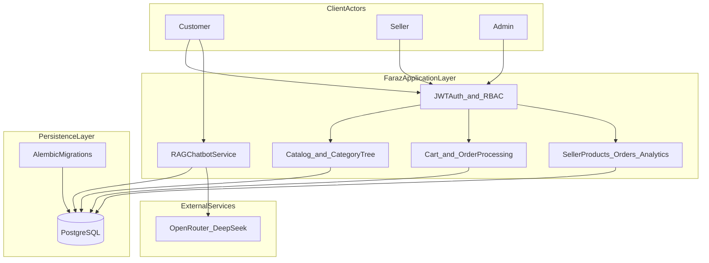

**Description**

The architecture separates client actors, application logic, persistence, and external services into distinct layers. All three actor types — Customer, Seller, and Admin — interact with Faraz through HTTP clients (Swagger UI during development, or a future web/mobile frontend). Before any protected operation is permitted, the request passes through the JWT auth module, which validates bearer tokens issued at login and enforces role-based access control through dependency functions such as `get_current_user`, `get_current_seller`, and `get_current_admin`. Public catalog browsing and anonymous chat do not require authentication; cart management, checkout, seller inventory, order fulfillment, and administrative actions do.

Once authenticated, the request is routed to one of four application modules within the Faraz application layer. The **Catalog module** handles category trees, product listing, filtering, and detail retrieval. The **Commerce module** manages shopping carts, order creation from cart, order history, wishlists, and reviews. The **Seller module** covers product lifecycle management, stock and price updates, order line item fulfillment, and analytics via `get_seller_dashboard` and `get_sales_summary`. Each module contains thin route handlers that delegate business logic to CRUD functions in `app/crud.py` and, where rules are non-trivial, to dedicated service classes such as `ProductService` and `SellerAnalytics`. These layers never access the database directly; instead, SQLAlchemy ORM models defined in `app/models.py` map to PostgreSQL tables, and CRUD functions execute queries, enforce validations, and commit transactions. This separation keeps route handlers focused on input validation and authorization while persistence logic remains reusable and testable.

The **Chat module** follows a distinct path optimized for retrieval-augmented generation rather than standard CRUD workflows. When a customer sends a message, `generate_chat_reply` orchestrates the response. First, `build_retrieval_context` gathers grounded data from PostgreSQL: `_search_products` matches keywords against active product names and descriptions, category names are loaded for navigation context, and — when the customer is authenticated — the five most recent orders are included so the assistant can reference real order status. This retrieved context is injected into a constrained system prompt that instructs the model to answer only from provided data and not invent prices, stock levels, or order states. The composed prompt is then sent to OpenRouter (DeepSeek model) via an HTTP request; if the API key is missing or the external call fails, the module returns a graceful fallback message rather than propagating an error to the client. The chat path reads from the same PostgreSQL database as the other modules but does not modify application state during a conversation.

Schema evolution is handled independently of runtime request processing by **Alembic migrations** in the persistence layer. Migration scripts under `alembic/versions/` define additive and structural changes to tables and columns; developers apply them with `alembic upgrade head` before running or seeding the application. This decoupling ensures that database structure changes are version-controlled, repeatable across teammate environments, and applied outside the normal request lifecycle — the running API does not alter schema during customer, seller, or chat operations.

### 2.2 Product Functions

- **Catalog** — Browse and filter products; navigate a two-level category tree; view product details and reviews.
- **Commerce** — Manage cart items, place orders from cart, track order history, maintain wishlists.
- **Seller operations** — Create and manage own products; update stock and price; view and fulfill order line items; access dashboard metrics and sales summaries.
- **Administration** — Manage users and roles; oversee catalog and shipments; act on behalf of sellers via seller scope.
- **AI support** — Answer customer questions about products, orders, shipping, and categories using RAG over live database data.

### 2.3 Use Case Model

The use case model summarizes the primary goals of each actor interacting with Faraz. Seven use cases cover authentication, customer commerce, seller operations, platform administration, and AI support. Diagram labels use concept names rather than HTTP routes.

#### Use Case Diagram

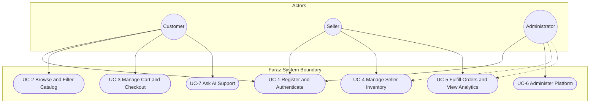

**Description:** Customers register, authenticate, browse the catalog, manage carts, place orders, and use the AI chatbot. Sellers authenticate, manage their product listings, fulfill order line items, and view dashboard analytics. Administrators authenticate and oversee users, roles, categories, and shipments; they may also act on behalf of a seller (dashed associations). All use cases execute within the Faraz system boundary; external clients and OpenRouter are environmental actors outside this diagram.

#### UC-1 — Register and Authenticate

| Field | Detail |
|-------|--------|
| **Primary actor** | Customer, Seller, Administrator |
| **Goal** | Create an account or obtain a JWT session for protected actions |
| **Preconditions** | Email is not already registered; admin creation requires a configured admin secret |
| **Main flow** | Actor submits registration or login credentials → system validates input → password is verified or hashed → JWT is issued on successful login |
| **Postconditions** | A user record exists (registration) or a valid bearer token is available (login) |
| **Enforced by** | `create_user`, `login`, `create_access_token`, `get_current_user` |

#### UC-2 — Browse and Filter Catalog

| Field | Detail |
|-------|--------|
| **Primary actor** | Customer (guest or authenticated) |
| **Goal** | Discover products and categories without signing in |
| **Preconditions** | Catalog data exists in PostgreSQL |
| **Main flow** | Actor opens category tree or product list → applies search, price, category, and sort filters → views product details and reviews |
| **Postconditions** | No persistent state change; inactive products are excluded from public results |
| **Enforced by** | `get_category_tree`, `get_products_filtered`, `get_product`, `get_reviews_for_product` |

#### UC-3 — Manage Cart and Checkout

| Field | Detail |
|-------|--------|
| **Primary actor** | Customer |
| **Goal** | Add items to a cart and convert the cart into a placed order |
| **Preconditions** | Customer is authenticated; at least one shipping address exists before checkout |
| **Main flow** | Actor adds or updates cart lines → system validates stock → actor initiates checkout → order and payment records are created → stock is decremented → cart is cleared |
| **Postconditions** | Order exists with snapshotted line prices; inventory reflects purchased quantities |
| **Enforced by** | `add_cart_item`, `update_cart_item`, `create_order_from_cart_for_user`, `get_orders` |

#### UC-4 — Manage Seller Inventory

| Field | Detail |
|-------|--------|
| **Primary actor** | Seller (Administrator may act via seller scope) |
| **Goal** | Create, update, deactivate, and price products owned by the seller |
| **Preconditions** | Actor is authenticated with seller or admin role; category assignment is valid |
| **Main flow** | Actor creates or edits a listing → system validates category, price, and stock → listing is saved or soft-deleted when order history requires it |
| **Postconditions** | Product catalog reflects seller inventory changes scoped to the effective seller identity |
| **Enforced by** | `resolve_seller_scope`, `create_product_record`, `update_product_record`, `update_product_stock`, `soft_delete_product` |

#### UC-5 — Fulfill Orders and View Analytics

| Field | Detail |
|-------|--------|
| **Primary actor** | Seller (Administrator may act via seller scope) |
| **Goal** | Process incoming order line items and monitor sales performance |
| **Preconditions** | Actor is authenticated; orders contain products owned by the seller |
| **Main flow** | Actor lists seller orders → selects a line item → submits an allowed fulfillment status → views dashboard KPIs and sales summaries |
| **Postconditions** | OrderItem status is updated when ownership and status rules pass; analytics reflect current data |
| **Enforced by** | `get_seller_orders`, `update_seller_order_item_status`, `get_seller_dashboard`, `get_sales_summary` |

#### UC-6 — Administer Platform

| Field | Detail |
|-------|--------|
| **Primary actor** | Administrator |
| **Goal** | Manage users, roles, categories, products, and shipments across the marketplace |
| **Preconditions** | Actor is authenticated with admin role |
| **Main flow** | Actor lists or updates users → changes roles → manages category tree → oversees shipments → optionally passes `seller_id` to seller-scoped endpoints |
| **Postconditions** | Platform configuration and user records reflect admin actions |
| **Enforced by** | `get_current_admin`, user CRUD, `admin_update_user_role`, category CRUD, shipment management |

#### UC-7 — Ask AI Support

| Field | Detail |
|-------|--------|
| **Primary actor** | Customer (guest or authenticated) |
| **Goal** | Receive a natural-language answer grounded in live catalog and order data |
| **Preconditions** | Chat message is within allowed length; database is reachable |
| **Main flow** | Actor sends a support question → system retrieves products, categories, and optional recent orders → composes a grounded prompt → OpenRouter returns a reply or a fallback message is shown |
| **Postconditions** | No application state is modified; response includes whether authentication enriched the context |
| **Enforced by** | `build_retrieval_context`, `generate_chat_reply`, `_search_products` |

### 2.4 User Characteristics

**Customer**

- Browses catalog, adds items to cart, checks out, leaves reviews, and uses the chatbot.
- Requires a registered account and JWT for cart, orders, and wishlist actions.
- May use chat anonymously or while authenticated for personalized order context.

**Seller**

- Manages inventory (products, stock, pricing) for items they own.
- Updates OrderItem fulfillment status for line items belonging to their products.
- Views dashboard KPIs and sales trends scoped to their seller identity.

**Admin**

- Full platform oversight: user CRUD, role changes, category management, shipment management.
- May pass `seller_id` to seller endpoints to view or manage another seller's data.

### 2.5 Constraints

Business rules limit how the system may change state. Violations produce explicit errors rather than silent correction.

| Event / Trigger | Condition | System Response | Enforced By |
|-----------------|-----------|-----------------|-------------|
| Add to cart | Requested `quantity > product.stock` | Reject — insufficient stock | `add_cart_item` |
| Update cart item | New quantity exceeds available stock | Reject — insufficient stock | `update_cart_item` |
| Checkout | User has no cart or cart is empty | Reject — cannot create order | `create_order_from_cart_for_user` |
| Checkout | User has no saved address | Reject — address required | `create_order_from_cart_for_user` |
| Checkout | Any line item exceeds stock | Reject — insufficient stock | `create_order_from_cart_for_user` |
| Create subcategory | Parent category already has a parent | Reject — max two category levels | `_validate_category_parent` |
| Delete product | Product has completed order items | Soft delete only (`is_active = false`) | `delete_or_soft_delete_product` |
| Seller updates line item | Product on line item not owned by seller | Reject — forbidden | `update_seller_order_item_status` |
| Seller updates line item | Status not in allowed set | Reject — invalid status | `update_seller_order_item_status` |
| Browse catalog (public) | Product `is_active = false` | Excluded from browse results | `get_products_filtered` |
| Chat query | LLM key missing or provider error | Return graceful fallback message | `generate_chat_reply` |
| Create product | Category does not exist | Reject — invalid category | `validate_category` |
| Product values | Price or stock negative | Reject — invalid values | `validate_product_values` |

### 2.6 Assumptions and Dependencies

#### Assumptions — System Side

The following conditions are assumed true for the Faraz backend to operate correctly in development and demonstration environments:

- **Database availability** — PostgreSQL is installed, running, and reachable at the host and credentials defined in `DATABASE_URL` within `.env`. The target database (e.g. `ecommerce_db`) exists before the application starts.
- **Schema readiness** — All teammates apply pending migrations with `alembic upgrade head` before seeding data or running smoke tests. The ORM models in `app/models.py` match the migrated schema; starting the server without migrations may cause query failures.
- **Environment configuration** — Required secrets and settings (`SECRET_KEY`, `DATABASE_URL`, JWT expiry) are present in `.env`. For chatbot features, `LLM_API_KEY`, `LLM_BASE_URL`, and `LLM_MODEL` are configured; without them the system still runs but returns fallback chat messages.
- **External LLM reachability** — When the chatbot is enabled, outbound HTTPS to OpenRouter is permitted from the server host. Network firewalls or proxy rules do not block completion requests initiated by `generate_chat_reply`.
- **Single-cart model** — Each user account owns at most one cart record. Checkout via `create_order_from_cart_for_user` clears cart items after a successful order; the system does not merge or split carts across devices.
- **Demo data** — Development and testing assume seeded users, categories, and products via `scripts/seed_data.py`. Idempotent seeding skips re-insertion if demo accounts already exist.
- **Deployment scope** — Version 1.0 assumes a single server process (Uvicorn) backed by one PostgreSQL instance. Load balancing, replication, caching layers, and container orchestration are not assumed.

#### Assumptions — Client Side

The following conditions are assumed about applications or users that consume Faraz:

- **HTTP capability** — Clients can send JSON request bodies and read JSON responses over HTTP. Swagger UI satisfies this for manual testing; production frontends must implement equivalent request handling.
- **Authentication flow** — Protected actions assume the client first obtains a JWT through `login`, then attaches it as `Authorization: Bearer <token>` on subsequent requests. Token expiry is governed by `ACCESS_TOKEN_EXPIRE_MINUTES`; expired tokens require re-login.
- **Role awareness** — Seller and admin clients present only actions valid for the authenticated user's role. The backend enforces RBAC regardless, but clients are assumed not to rely on obscurity for authorization.
- **Address before checkout** — Customers are assumed to register at least one address before attempting checkout. The commerce m odule rejects order creation when no address exists.
- **Chat usage** — Clients may invoke the chatbot with or without authentication. Unauthenticated chat receives product and category context only; authenticated chat additionally receives recent order history for personalized replies.
- **No payment UI integration** — Clients do not assume a live payment gateway in v1.0. Checkout creates orders and payment records as placeholders; no card capture or third-party payment redirect is expected.

#### Dependencies — System Side

| Dependency | Purpose |
|------------|---------|
| Python 3.x | Runtime for FastAPI application, scripts, and Alembic CLI |
| FastAPI | Web framework, routing, dependency injection, OpenAPI/Swagger |
| Uvicorn | ASGI server hosting the application process |
| SQLAlchemy | ORM mapping between `app/models.py` and PostgreSQL tables |
| Alembic | Versioned schema migrations under `alembic/versions/` |
| psycopg2-binary | PostgreSQL database driver |
| httpx | Async HTTP client for OpenRouter calls in `generate_chat_reply` |
| passlib / bcrypt | Password hashing in `hash_password` and `verify_password` |
| python-jose | JWT creation and validation in `create_access_token` and auth dependencies |
| PostgreSQL 12+ | Relational database for all persistent entities |
| OpenRouter account | External LLM provider for RAG chatbot completions (optional but required for live AI replies) |

#### Dependencies — Client Side

| Dependency | Purpose |
|------------|---------|
| HTTP client | Browser, mobile SDK, or API tool capable of REST-style requests |
| JSON serialization | Encode request payloads and decode response bodies |
| Bearer token storage | Secure storage or session mechanism for JWT after `login` (browser local storage, mobile keychain, etc.) |
| Swagger UI (development) | Interactive API explorer bundled with FastAPI at `/docs` for manual testing without a custom frontend |
| Future web/mobile frontend (optional) | Not shipped with Faraz v1.0; expected to consume the same auth and module contracts when built |

The system-side dependencies must be installed on the server host (Python virtual environment, PostgreSQL service, network egress to OpenRouter). Client-side dependencies apply to whatever application presents Faraz to end users; during development, Swagger UI alone is sufficient to exercise all roles and flows.

### 2.7 Apportioning of Requirements

Apportioning assigns each requirement to a release, priority, and owning module so the team can implement and test Faraz incrementally without ambiguity about scope.

#### Release 1.0 Scope (In Scope)

| Release | Requirement IDs | Deliverable |
|---------|-----------------|-------------|
| v1.0 — Core | FR-001 – FR-012, NFR-001 – NFR-007 | Full backend API: auth, catalog, commerce, seller ops, admin RBAC, RAG chatbot |

#### Release 1.0 Exclusions (Deferred)

| Item | Reason | Target |
|------|--------|--------|
| Frontend UI | API-only academic deliverable | Future client application |
| Payment gateway | Placeholder payment records only | Future integration |
| Seller approval workflow | Not implemented in v1.0; sellers register with immediate access | Future enhancement |
| Seller shop profile entity | Seller identity is `User` with `role=seller` | Future `SellerProfile` table |
| Multi-turn chat history | Explicitly out of scope per Section 1.1 | Future chat session store |
| Category depth beyond two levels | Business constraint | Not planned for v1.0 |

#### Priority Classification

| Priority | Meaning | Examples |
|----------|---------|----------|
| **Must** | Required for v1.0 demonstration and smoke tests | Login, catalog browse, cart/checkout, seller product CRUD, seller order fulfillment, admin user management |
| **Should** | Expected in v1.0 but degradable | Live OpenRouter chat replies (fallback acceptable), seller dashboard analytics |
| **Could** | Enhancement beyond minimum viable API | Wishlist, reviews, shipment tracking UI concepts |

#### Module Allocation

| Requirement Area | Use Case | Primary Owner | Supporting Components | FR / NFR |
|------------------|----------|---------------|----------------------|----------|
| Authentication and session | UC-1 | Auth module | `login`, `create_access_token`, `get_current_user`, `get_current_admin`, `get_current_seller` | FR-001, FR-002, FR-003, NFR-004, NFR-005 |
| Catalog browse and filter | UC-2 | Catalog module | `get_products_filtered`, `get_category_tree`, `get_product` | FR-004, FR-005, NFR-001 |
| Category management | UC-6 | Catalog module | `create_category`, `_validate_category_parent`, `get_category_children` | FR-004 |
| Cart management | UC-3 | Commerce module | `add_cart_item`, `update_cart_item`, `remove_cart_item`, `get_cart` | FR-006 |
| Checkout and orders | UC-3 | Commerce module | `create_order_from_cart_for_user`, `get_orders`, `get_order` | FR-007 |
| Product lifecycle | UC-4 | ProductService | `validate_category`, `create_product_record`, `soft_delete_product`, `update_product_stock` | FR-008, FR-009 |
| Seller fulfillment | UC-5 | Seller module | `get_seller_orders`, `update_seller_order_item_status` | FR-010 |
| Seller analytics | UC-5 | SellerAnalytics | `get_seller_dashboard`, `get_sales_summary` | FR-011 |
| AI customer support | UC-7 | ChatbotService | `build_retrieval_context`, `generate_chat_reply`, `_search_products` | FR-012, NFR-002, NFR-003 |
| Platform administration | UC-6 | Admin RBAC | `get_current_admin`, user CRUD, `admin_update_user_role` | FR-003 |
| Schema evolution | All | Alembic | Migration scripts under `alembic/versions/` | NFR-006 |
| Automated validation | All | Test scripts | `scripts/test_api.py`, `scripts/seed_data.py` | NFR-007 |

#### Cross-Cutting Concerns

- **RBAC** spans UC-1, UC-4, UC-5, and UC-6 — enforced at route dependencies before any module handler executes.
- **Stock validation** spans UC-3 and UC-4 — cart, checkout, and inventory updates share product stock invariants.
- **Soft delete** spans UC-4 and UC-2 — deactivated products disappear from public catalog but remain for order history.

### 2.8 Restrictions

#### User Side Software

- Clients must be capable of sending HTTP requests with JSON bodies and optional `Authorization: Bearer` headers.
- Swagger UI or an equivalent API client is sufficient for development and demonstration.
- Protected actions (cart, checkout, seller panel, admin) require a valid JWT obtained through `login`.
- The chatbot accepts messages with or without authentication; authenticated sessions enrich retrieval with recent order history.
- No specific browser, operating system, or mobile platform is mandated beyond general HTTP client support.

#### System Side Software

- Server runs on Python with FastAPI; PostgreSQL is the sole supported relational database.
- Network egress to OpenRouter (`LLM_BASE_URL`) is required for live chatbot responses.
- Horizontal scaling, load balancing, and container orchestration are not assumed in version 1.0.
- File storage, CDN, and email notification services are not part of the current deployment model.
- Secrets (`SECRET_KEY`, `LLM_API_KEY`, database credentials) are loaded from environment variables via `.env`.

---

## Section 3 — Specific Requirements

This section states the detailed requirements Faraz shall satisfy. Functional requirements map to the use cases in Section 2.3; non-functional requirements constrain how those functions perform, secure data, and remain maintainable. Implementation references name application-layer functions for traceability; they are not HTTP route specifications.

### 3.1 External Interface Requirements

#### 3.1.1 User Interfaces (Conceptual)

The backend is API-only in v1.0. A future frontend is expected to realize the following conceptual interfaces:

| Conceptual Interface | Actor | Primary Use Case | Key Functions |
|---------------------|-------|------------------|---------------|
| Registration and login forms | Customer, Seller, Admin | UC-1 | `create_user`, `login` |
| Catalog and product detail pages | Customer | UC-2 | `get_products_filtered`, `get_category_tree`, `get_product` |
| Cart and checkout flow | Customer | UC-3 | `get_cart`, `add_cart_item`, `create_order_from_cart_for_user` |
| Order history view | Customer | UC-3 | `get_orders`, `get_order` |
| Seller inventory panel | Seller | UC-4 | `get_seller_products`, `create_product_record`, `update_product_stock` |
| Seller fulfillment and dashboard | Seller | UC-5 | `get_seller_orders`, `update_seller_order_item_status`, `get_seller_dashboard` |
| Admin management console | Admin | UC-6 | User CRUD, category CRUD, shipment management |
| Chat widget | Customer | UC-7 | `generate_chat_reply` |

#### 3.1.2 Software Interfaces

| Interface | Direction | Protocol | Purpose |
|-----------|-----------|----------|---------|
| Client → Faraz API | Inbound | HTTP/JSON, REST-style | All catalog, commerce, seller, admin, and chat operations |
| Faraz → PostgreSQL | Outbound | SQL via SQLAlchemy | Persistent storage for all entities |
| Faraz → OpenRouter | Outbound | HTTPS JSON (`/chat/completions`) | LLM completions for UC-7 |
| Developer → Alembic CLI | Local | CLI | Schema migration before runtime |

#### 3.1.3 Communications Interfaces

- All client communication uses HTTP with JSON request and response bodies.
- Authenticated requests shall include `Authorization: Bearer <JWT>`.
- Chat requests accept an optional bearer token; when absent, retrieval excludes order history.

### 3.2 System Feature Requirements (Functional)

Each functional requirement below shall be verifiable through API smoke tests or manual Swagger execution after database seeding.

| ID | Use Case | Requirement | Verification |
|----|----------|-------------|--------------|
| FR-001 | UC-1 | The system shall authenticate users via email and password and issue a JWT through `login` and `create_access_token`. | Login returns bearer token for valid credentials; invalid credentials return 401. |
| FR-002 | UC-1 | The system shall register customers and sellers via `create_user` with role assignment; admin self-registration requires a server-configured secret. | Signup creates user with requested role; duplicate email rejected. |
| FR-003 | UC-1, UC-6 | The system shall restrict admin-only actions to users with role `admin` via `get_current_admin`. | Non-admin receives 403 on admin endpoints. |
| FR-004 | UC-2, UC-6 | The system shall expose a two-level category tree through `get_category_tree` and `get_category_children`. | Tree returns top-level categories with children; third level rejected on create. |
| FR-005 | UC-2 | The system shall list and filter products by search term, price range, category, and sort order via `get_products_filtered`. | Filters narrow results; inactive products excluded from public browse. |
| FR-006 | UC-3 | The system shall validate stock before adding or updating cart items via `add_cart_item` and `update_cart_item`. | Quantity exceeding stock returns error without cart change. |
| FR-007 | UC-3 | The system shall create an order from the user's cart via `create_order_from_cart_for_user`, decrementing stock and clearing the cart. | Order total matches line snapshots; cart empty after success. |
| FR-008 | UC-4 | The system shall allow sellers to manage only their own products, resolved through `resolve_seller_scope`. | Seller cannot modify another seller's product. |
| FR-009 | UC-4 | The system shall soft-delete products with completed order history via `soft_delete_product`. | Product with delivered/cancelled lines set `is_active=false` instead of hard delete. |
| FR-010 | UC-5 | The system shall let sellers list orders containing their products via `get_seller_orders` and update line item status via `update_seller_order_item_status`. | Status update rejected when item not owned or status invalid. |
| FR-011 | UC-5 | The system shall provide seller dashboard metrics and sales summaries via `get_seller_dashboard` and `get_sales_summary`. | Dashboard returns product counts, revenue aggregates, and recent orders. |
| FR-012 | UC-7 | The system shall answer customer chat messages using RAG via `build_retrieval_context` and `generate_chat_reply`, with graceful fallback when the LLM is unavailable. | Missing key or provider error returns fallback text, not unhandled 500. |

#### 3.2.1 Functional Requirement Dependencies

- FR-006 and FR-007 depend on FR-001 (authenticated customer) and valid address data.
- FR-008 through FR-011 depend on FR-002 (seller account) and FR-001 (seller login).
- FR-012 depends on PostgreSQL catalog data; authenticated enrichment additionally depends on FR-007 (orders exist).

### 3.3 Data Requirements

#### 3.3.1 Logical Data Model

| Entity | Purpose | Key Fields |
|--------|---------|------------|
| User | Registered account | `name`, `email`, `password` (hashed), `role`, `is_active` |
| Address | Shipping address for orders | `street`, `city`, `state`, `country`, `postal_code`, linked to User |

Roles: `customer`, `seller`, `admin`. Each user may have multiple addresses; checkout uses the first address on file. A seller is a `User` with `role = seller`; products reference the seller through `seller_id`.

#### 3.3.2 Catalog Domain

| Entity | Purpose | Key Fields |
|--------|---------|------------|
| Category | Product grouping (max 2 levels) | `name`, `description`, `parent_id` (self-reference) |
| Product | Sellable item | `name`, `description`, `price`, `stock`, `category_id`, `seller_id`, `is_active` |

Categories form a tree: top-level nodes have `parent_id = null`; subcategories reference a top-level parent only. Each product belongs to exactly one category and one seller.

#### 3.3.3 Commerce Domain

| Entity | Purpose | Key Fields |
|--------|---------|------------|
| Cart | Pre-checkout basket (one per user) | `user_id` |
| CartItem | Line in cart | `product_id`, `quantity` |
| Order | Placed purchase | `user_id`, `address_id`, `total_amount`, `status` |
| OrderItem | Line on order | `product_id`, `quantity`, `price` (snapshot), `status` |
| Payment | Payment record (placeholder) | `amount`, `method`, `status` |
| Shipment | Delivery tracking | `tracking_number`, `carrier`, `status` |

On checkout, `create_order_from_cart_for_user` snapshots product price into OrderItem, sets initial status to Pending, decrements stock, computes `total_amount`, and clears the cart.

#### 3.3.4 Engagement Domain

| Entity | Purpose | Key Fields |
|--------|---------|------------|
| Review | Product rating and comment | `user_id`, `product_id`, `rating`, `comment` |
| Wishlist | Saved product for later | `user_id`, `product_id` |

#### 3.3.5 Key Invariants

- `order.total_amount = sum(order_item.price × order_item.quantity)` at checkout time.
- Stock is decremented when an order is created, not when items are added to cart.
- Inactive products (`is_active = false`) are hidden from public catalog queries.
- OrderItem statuses are drawn from: Pending, Processing, Shipped, Delivered, Cancelled.
- Completed statuses (Delivered, Cancelled) prevent hard deletion of associated products.

#### 3.3.6 Class Diagram

The diagram follows standard UML class notation:

- **Attributes** — `+name: type` (persisted fields; no parentheses)
- **Public operations** — `+operationName()` (behaviour exposed to the application layer)
- **Private operations** — `-operationName()` (internal validation or helper steps)

Concept names are used instead of code identifiers. `+` = public, `-` = private.

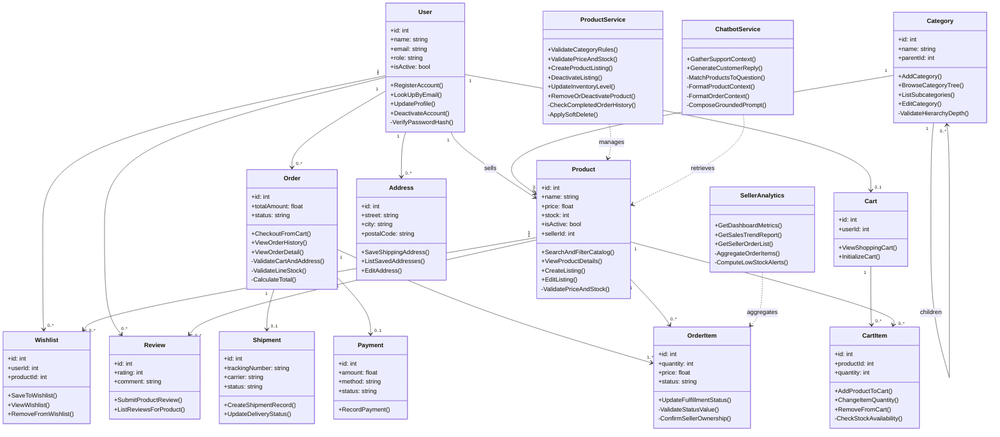

**Description:** Each class is split into **attributes** (typed fields, no brackets) and **operations** (methods with `()`). Public operations (`+`) represent actions available through the application layer — for example `+CheckoutFromCart()` on `Order` or `+GenerateCustomerReply()` on `ChatbotService`. Private operations (`-`) represent internal steps such as `Order.-ValidateLineStock()` during checkout or `ChatbotService.-MatchProductsToQuestion()` during context gathering. Entity classes model persisted data plus the main lifecycle actions on that data; service classes model business rules and analytics with both public entry points and private helpers. `Payment` includes one public operation because payment rows are recorded at checkout time.

### 3.4 Performance Requirements

| ID | Requirement | Measure | Related Use Case |
|----|-------------|---------|------------------|
| NFR-001 | Catalog list and filter operations should respond within **500 ms** under local development conditions with seeded data. | Wall-clock time from request to JSON response | UC-2 |
| NFR-002 | Chatbot LLM calls should complete or **timeout within 30 seconds**. | `httpx` client timeout in `generate_chat_reply` | UC-7 |

### 3.5 Security Requirements

| ID | Requirement | Implementation |
|----|-------------|----------------|
| NFR-004 | Passwords shall be stored hashed; plaintext passwords shall not be persisted. | `hash_password`, `verify_password` (bcrypt via passlib) |
| NFR-004 | JWT secret shall be configured via environment variable, not hard-coded in production. | `SECRET_KEY` in `.env` |
| NFR-005 | RBAC shall enforce role boundaries on all protected operations. | `get_current_admin`, `get_current_seller`, `resolve_seller_scope` |
| NFR-005 | Admin creation shall require a server-side secret not exposed to public signup. | `ADMIN_CREATION_KEY` on `admin/signup` |

### 3.6 Availability and Reliability Requirements

| ID | Requirement | Notes |
|----|-------------|-------|
| NFR-003 | Chatbot availability depends on OpenRouter service uptime and valid API credentials. | Missing or invalid key returns fallback message; API remains operational |
| NFR-003 | Core catalog and commerce functions shall remain available when OpenRouter is unreachable. | Chat degrades gracefully; other modules unaffected |

### 3.7 Maintainability and Testability Requirements

| ID | Requirement | Implementation |
|----|-------------|----------------|
| NFR-006 | Schema changes shall be applied through Alembic migrations, not manual SQL in production workflows. | `alembic/versions/` |
| NFR-007 | Automated smoke tests shall validate core flows after seeding. | `scripts/test_api.py` against seeded demo accounts |
| NFR-007 | Demo data seeding shall be idempotent for repeatable teammate environments. | `scripts/seed_data.py` skips existing demo users |

### 3.8 Design Constraints

Faraz v1.0 shall conform to the following design constraints in addition to the business rules in Section 2.5:

| Constraint | Requirement |
|------------|-------------|
| Architecture | Layered: route handlers → services/CRUD → SQLAlchemy ORM → PostgreSQL |
| Presentation | No server-side UI; OpenAPI/Swagger documents the API |
| Category depth | Maximum two levels (top-level + subcategory) |
| Product deletion | Soft delete when completed order history exists |
| Payment processing | Placeholder records only; no live gateway |
| Chat sessions | Stateless single-turn requests; no conversation persistence |
| Seller identity | Single `User` table with role; no separate seller profile entity in v1.0 |
| Deployment | Single Uvicorn process and one PostgreSQL instance |

#### 3.8.1 System Architecture Summary

1. **Presentation layer (external)** — Clients render UI or invoke Swagger; no presentation logic lives in the backend.
2. **Application layer** — FastAPI route handlers in `app/main.py` validate input, enforce RBAC dependencies, and delegate to CRUD functions or service modules.
3. **Service layer** — `ProductService`, `SellerAnalytics`, and `ChatbotService` encapsulate business rules, analytics queries, and external LLM integration.
4. **Data access layer** — SQLAlchemy ORM models and CRUD functions in `app/crud.py` execute queries against PostgreSQL.
5. **External services** — OpenRouter provides LLM completions for the chatbot.

Request flow: client action → auth dependency (if required) → handler → service/CRUD → database → response serialization via Pydantic schemas.

---

## Section 4 — External Interface Descriptions

### 4.1 User Interface (Conceptual)

The backend is API-only today. A future frontend is expected to provide:

| Conceptual Page | Primary Functions Used |
|-----------------|------------------------|
| Catalog home | `get_products_filtered`, `get_category_tree` |
| Product detail | `get_product`, `get_reviews_for_product` |
| Cart and checkout | `get_cart`, `add_cart_item`, `create_order_from_cart_for_user` |
| Order history | `get_orders`, `get_order` |
| Seller dashboard | `get_seller_dashboard`, `get_sales_summary`, `get_seller_orders` |
| Seller inventory | `get_seller_products`, `create_product_record`, `update_product_stock` |
| Chat widget | `generate_chat_reply` (optional authenticated context) |
| Admin panel | User CRUD, category management, shipment management |

### 4.2 AI Integration

The chatbot service integrates with OpenRouter:

- **Retrieval:** `build_retrieval_context` searches products by message keywords, loads category names, and optionally fetches the user's last five orders when authenticated.
- **Completion:** `generate_chat_reply` sends a system prompt plus retrieval context to OpenRouter at `LLM_BASE_URL` using model `LLM_MODEL`.
- **Configuration:** `LLM_API_KEY`, `LLM_BASE_URL`, `LLM_MODEL`, and `OPENROUTER_SITE_URL` are read from environment variables.
- **Fallback:** If the API key is missing or the HTTP call fails, a static helpful message is returned without raising an unhandled error.

---

## Appendix — UML Diagrams

### A.1 Sequence Diagram — Authentication (SD-1)

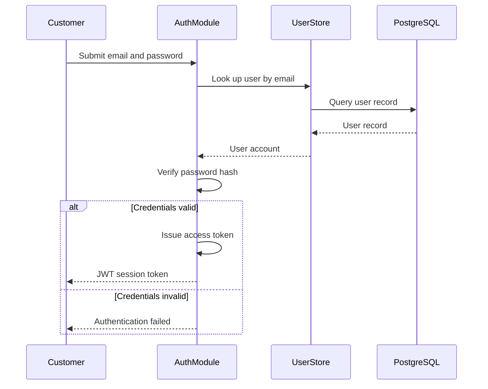

**Description:** The customer submits login credentials to the auth module. The system looks up the matching user record in PostgreSQL and verifies the password against the stored hash. On success, an access token is issued for subsequent authenticated sessions; on failure, the customer receives an authentication error with no token.

---

### A.2 Sequence Diagram — Cart and Checkout (SD-2)

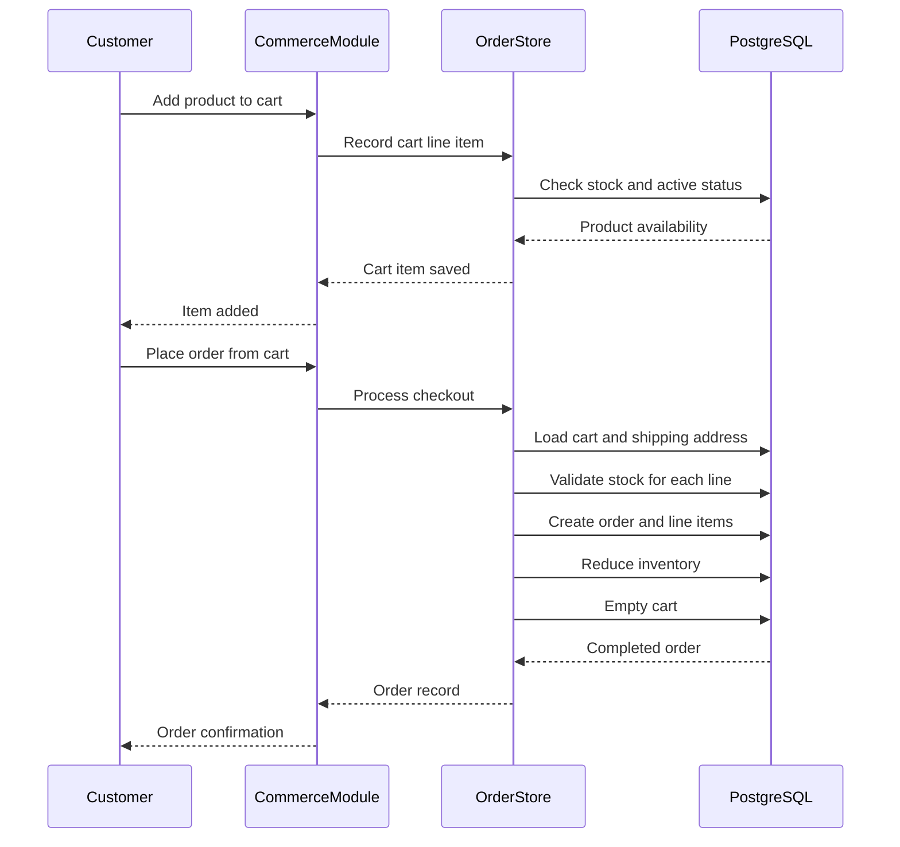

**Description:** Adding to cart checks that the product is active and that the requested quantity is available. Checkout validates that the cart is not empty and that the customer has a shipping address, then creates the order with price snapshots, reduces stock, calculates the total, and clears the cart. The customer receives the confirmed order.

---

### A.3 Sequence Diagram — AI Chatbot RAG (SD-3)

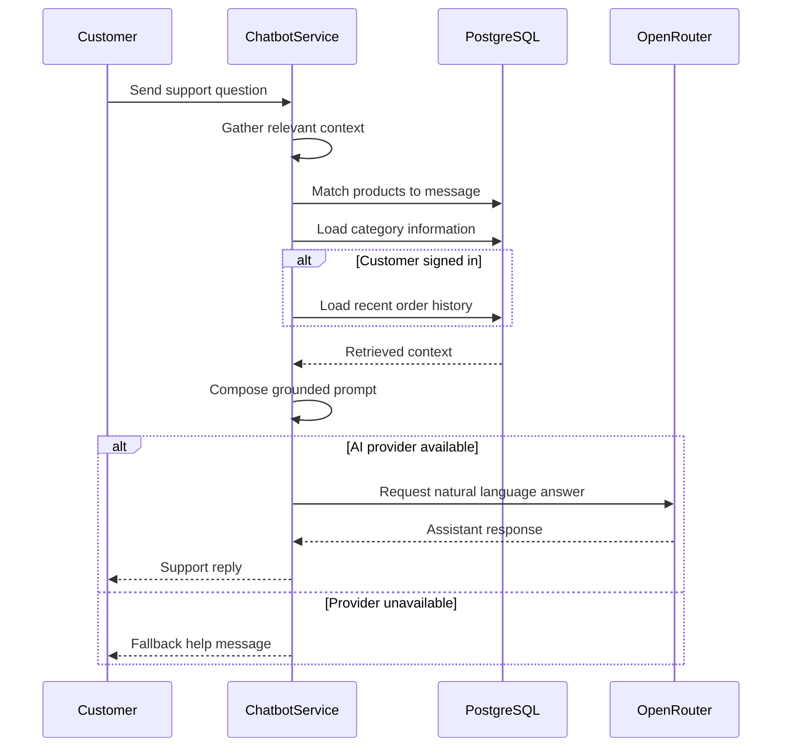

**Description:** The customer sends a support question. The chatbot first retrieves matching products, category information, and — when the customer is signed in — recent orders from PostgreSQL. That context is combined with rules that forbid inventing prices or order statuses. If the AI provider is available, a natural-language reply is returned; otherwise the customer sees a fallback message.

---

### A.4 Sequence Diagram — Seller Fulfillment (SD-4)

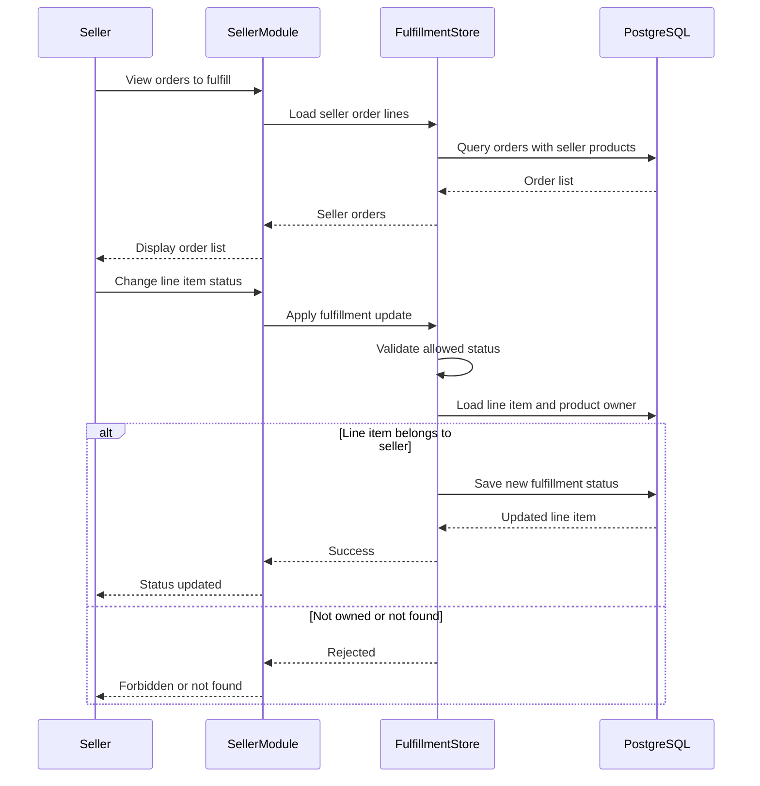

**Description:** The seller views orders that contain their products, scoped to their seller identity. To fulfill a line item, they submit a new status; the system validates that the status is allowed and that the product on that line belongs to the seller. Successful updates are persisted; rejected attempts return an error without changing data.

---

### A.5 Activity Diagram — Catalog Browse and Filter (AD-1)

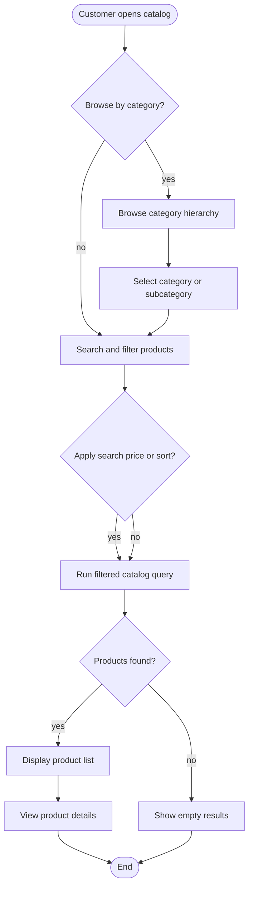

**Description:** The customer may browse the category hierarchy before searching products. Filters for search text, price range, category, and sort order narrow the catalog. Matching products are listed for selection; if none match, an empty state is shown. Selecting a product opens its detail view.

---

### A.6 Activity Diagram — Seller Order Fulfillment (AD-2)

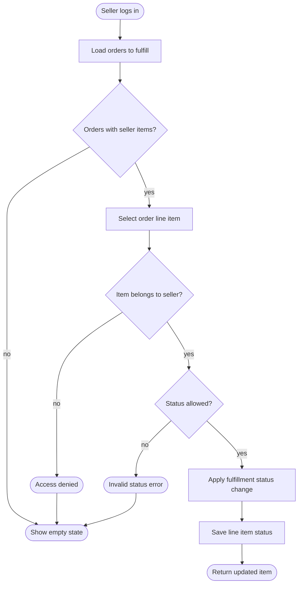

**Description:** After login, the seller loads orders containing their products. Each status change checks that the line item belongs to the seller and that the new status is valid. Allowed changes are saved; ownership or validation failures end without updating data.

---

### A.7 Activity Diagram — Product Lifecycle (AD-3)

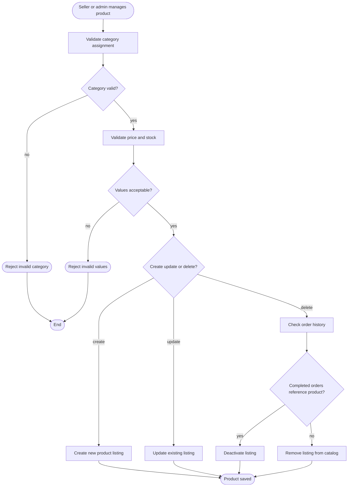

**Description:** Product management starts with validating the category and price/stock values. Creation and update save the listing to the catalog. Deletion checks order history: products referenced by completed orders are deactivated rather than removed; otherwise the listing may be deleted outright.

---

### A.8 Activity Diagram — AI Chatbot RAG (AD-4)

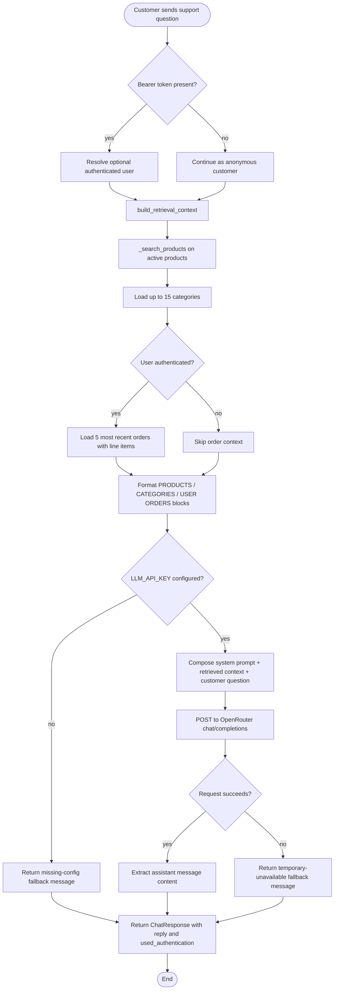

**Description:** A customer submits a support question through the chat endpoint. Authentication is optional: if a valid JWT is present, the system resolves the user so order history can be included; otherwise the chat runs anonymously with catalog context only. The chatbot service builds retrieval context from PostgreSQL — matching active products by message keywords, loading categories, and optionally loading the five most recent orders for signed-in customers. That context is combined with a constrained system prompt. If `LLM_API_KEY` is missing, a configuration fallback is returned. If the key is present, the prompt is sent to OpenRouter; success yields the model reply, failure yields a graceful unavailable message. No application state is modified and no chat history is stored between requests.

---

*End of document*
